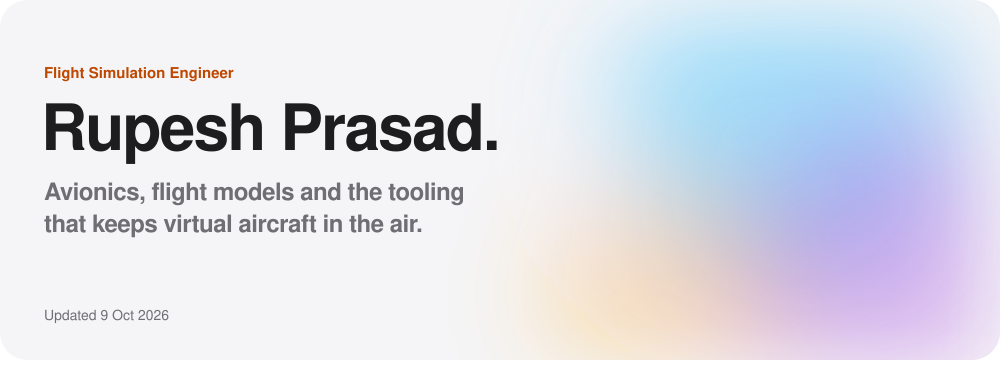
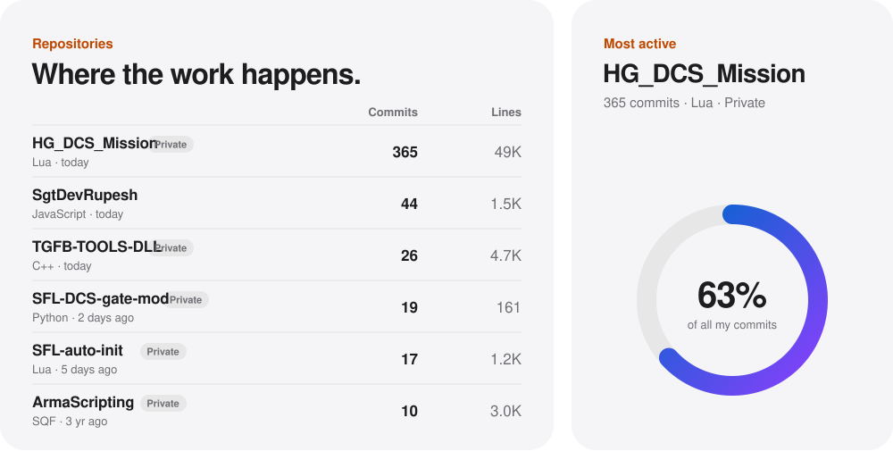

<picture>
  <source media="(prefers-color-scheme: dark)" srcset="metrics/hero-dark.svg">
  
</picture>

  

<picture>
  <source media="(prefers-color-scheme: dark)" srcset="metrics/repos-dark.svg">
  
</picture>

  

<picture>
  <source media="(prefers-color-scheme: dark)" srcset="metrics/craft-dark.svg">
  
</picture>
